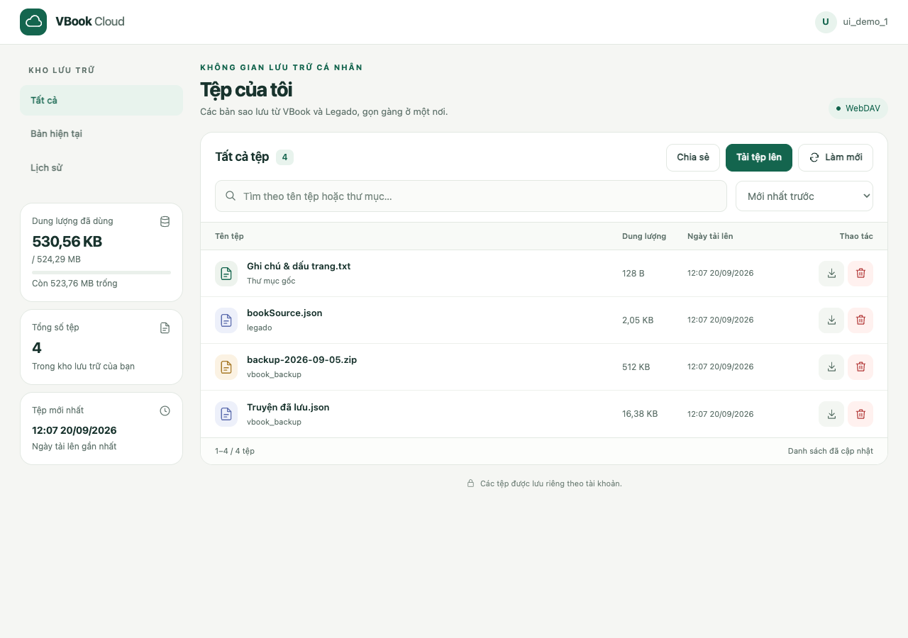
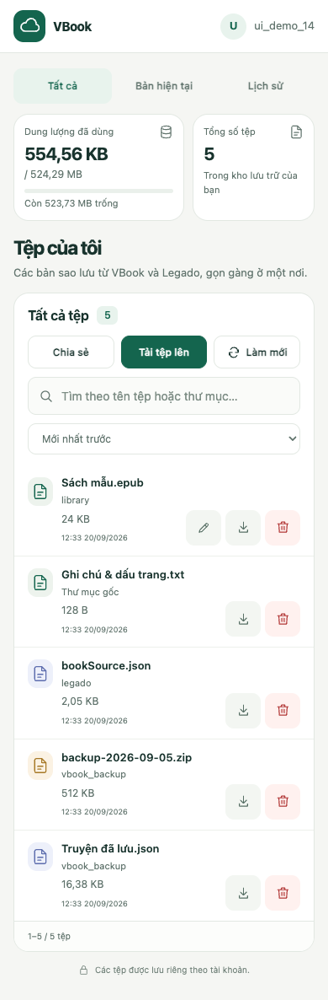
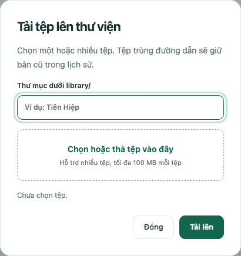
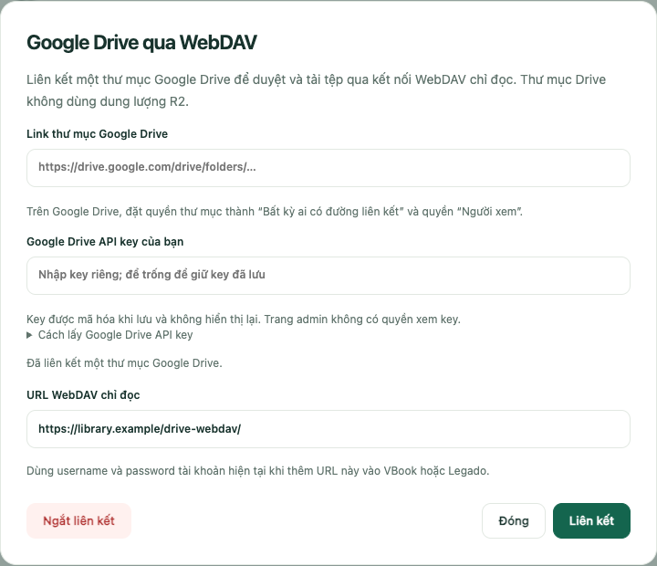
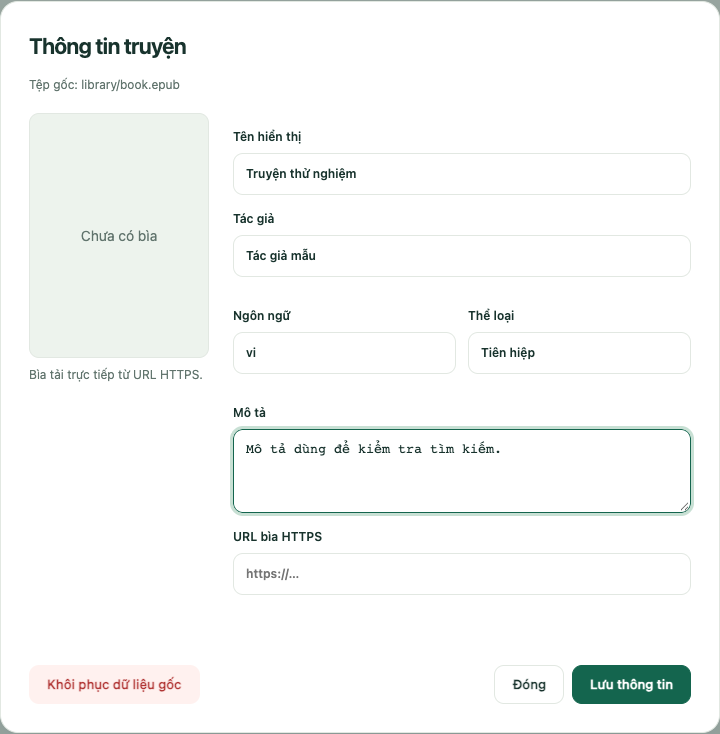
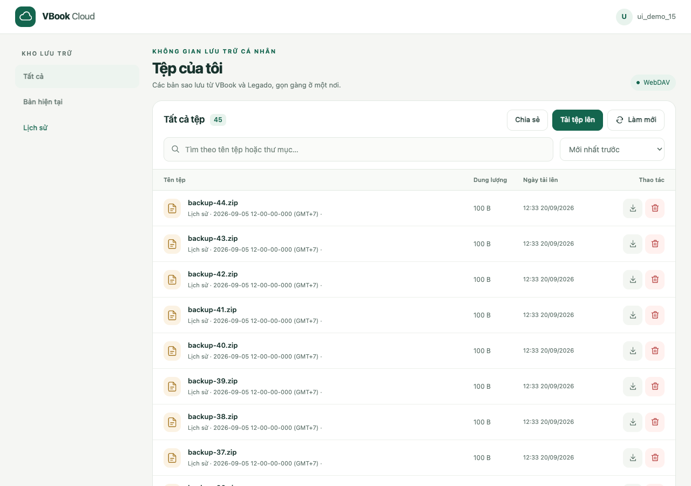
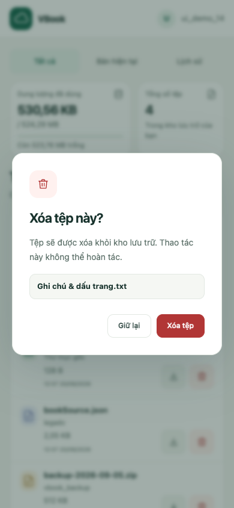
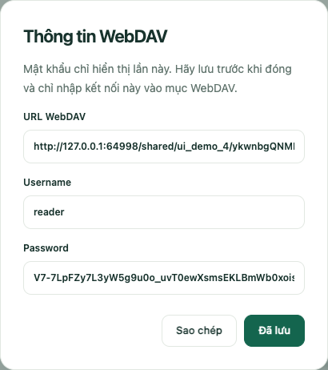

# VBook WebDAV Cloud

Kho lưu trữ cá nhân dành cho VBook, Legado và các ứng dụng hỗ trợ WebDAV. Người dùng có thể sao lưu dữ liệu, tải truyện lên thư viện, tìm lại bản cũ và chia sẻ thư viện ở chế độ chỉ đọc.

Dịch vụ này phù hợp cho cá nhân, gia đình hoặc nhóm người dùng tin cậy. Bạn chỉ cần địa chỉ máy chủ, tên tài khoản và mật khẩu do người quản trị cung cấp.

> Các ảnh trong hướng dẫn dùng tài khoản, mật khẩu và file giả để minh họa.

## Bắt đầu nhanh

1. Mở địa chỉ web do người quản trị cung cấp.
2. Nhập **Username** và **Password** khi trình duyệt hỏi đăng nhập.
3. Chọn **Tải tệp lên** nếu muốn thêm truyện từ máy.
4. Chọn **Làm mới** sau khi vừa sao lưu từ VBook hoặc Legado.
5. Dùng ô tìm kiếm hoặc các mục **Tất cả**, **Bản hiện tại**, **Lịch sử** để tìm file.

Mật khẩu tài khoản dùng cho web và WebDAV. Mã PIN của trang quản trị không phải mật khẩu người dùng.

## Kết nối VBook hoặc Legado qua WebDAV

Trong phần sao lưu WebDAV của ứng dụng, điền đúng thông tin được cung cấp:

| Ô trong ứng dụng | Giá trị cần điền |
| --- | --- |
| Server / URL | Địa chỉ WebDAV đầy đủ |
| Username | Tên tài khoản của bạn |
| Password | Mật khẩu tài khoản |
| Thư mục backup | Ví dụ `vbook_backup`, nếu ứng dụng yêu cầu |

Sau khi lưu cấu hình:

1. Chọn **Kiểm tra kết nối** nếu ứng dụng có chức năng này.
2. Chọn **Sao lưu / Backup**.
3. Chờ ứng dụng báo hoàn tất.
4. Quay lại trang web và bấm **Làm mới** để xem file mới.

Tên menu có thể khác tùy phiên bản ứng dụng. Nếu kiểm tra kết nối thất bại, hãy dán lại nguyên URL và kiểm tra xem mật khẩu có khoảng trắng thừa hay không.

## Sử dụng trang quản lý file

| Thành phần | Công dụng |
| --- | --- |
| **Tất cả** | Hiển thị file hiện tại và lịch sử |
| **Bản hiện tại** | Chỉ hiển thị file đang được ứng dụng sử dụng |
| **Lịch sử** | Hiển thị những phiên bản cũ được giữ lại khi file bị ghi đè |
| Ô tìm kiếm | Tìm theo tên file, thư mục, tên truyện, tác giả hoặc metadata đã chỉnh sửa |
| Ô sắp xếp | Sắp xếp theo ngày, tên hoặc dung lượng |
| **Làm mới** | Tải lại danh sách từ máy chủ |

Mỗi trang hiển thị tối đa 20 file. Dùng các nút mũi tên ở cuối danh sách để chuyển trang.

### Các nút cạnh mỗi file

| Biểu tượng | Thao tác |
| --- | --- |
| Bút chì | Sửa thông tin truyện; chỉ có với file trong `library/` |
| Mũi tên tải xuống | Tải file về thiết bị |
| Thùng rác màu đỏ | Xóa file sau bước xác nhận |

Trên điện thoại, các nút được thu gọn thành icon nhưng vẫn có vùng chạm lớn và giữ đúng thứ tự **Sửa → Tải xuống → Xóa**.

## Tạo thư mục và upload extension thủ công

1. Bấm icon **thư mục có dấu cộng** trên thanh thao tác (tooltip **Tạo thư mục**).
2. Ở thư mục gốc, nhập `vbookext` rồi bấm **Tạo**. Bấm tên thư mục để mở.
3. Trong `vbookext`, tạo thư mục `ten-extension`. Mở thư mục này và tạo tiếp `src`. Bạn cũng có thể nhập đường dẫn nhiều cấp; đường dẫn được tính từ thư mục đang mở.
4. Bấm **Tải tệp lên** để upload vào thư mục đang mở. Bấm các tên trên thanh đường dẫn để quay lại thư mục cha. Thư mục rỗng vẫn hiển thị sau khi tải lại trang.
5. Upload `plugin.json`, `icon.png` vào `vbookext/ten-extension`; upload các file JavaScript vào `vbookext/ten-extension/src`.

Bạn chọn nhiều file được, nhưng cần upload riêng từng cấp thư mục để giữ cấu trúc extension. Mặc định danh sách chỉ hiển thị nội dung thư mục đang mở; bấm **Xem tất cả tệp** để xem danh sách tổng hợp. Tìm kiếm trong một thư mục bao gồm tệp trong các thư mục con. Nếu tạo nhiều cấp bị gián đoạn, những cấp đã tạo vẫn được giữ; làm mới danh sách rồi thử lại.

## Tải truyện lên thư viện

### Chọn kiểu xem và di chuyển tệp

- Hai nút icon **Danh sách chi tiết** và **Dạng lưới** đổi cách hiển thị cả tệp lẫn thư mục. Trình duyệt ghi nhớ lựa chọn này.
- Trên máy tính, kéo tệp hoặc thư mục thả vào thư mục đích. Có thể thả lên tên thư mục trên thanh đường dẫn để chuyển về thư mục cha hoặc thư mục gốc.
- Trên màn hình cảm ứng, nhấn giữ tệp hoặc thư mục đến khi nhãn kéo xuất hiện, rồi kéo tới thư mục đích và thả. Vuốt bình thường vẫn cuộn trang. Cả list và grid đều hỗ trợ kéo thả, kể cả khi đang xem tất cả tệp.
- Có thể thả tệp từ máy tính trực tiếp vào vùng quản lý hoặc lên một thư mục để mở hộp upload với đúng thư mục đích, rồi bấm **Tải lên**. Thư mục từ máy tính cần được tạo và upload các tệp bên trong theo từng cấp như hướng dẫn phía trên.
- Thư mục được chuyển cùng toàn bộ nội dung. Nếu đích đã có mục trùng tên, thao tác bị từ chối; không ghi đè. Không thể chuyển một thư mục vào chính nó hoặc thư mục con của nó. Mục trong **Lịch sử** không hỗ trợ di chuyển.
- Với thư mục lớn hoặc khi mất kết nối, máy chủ tiếp tục công việc đã nhận. Bấm **Làm mới** để kiểm tra kết quả trước khi thử lại.

### Upload tệp

1. Chọn **Tải tệp lên**.
2. Chọn **Thư mục đích**, ví dụ `library/Tiên Hiệp` hoặc `vbookext/ten-extension/src`.
3. Chọn file hoặc kéo thả nhiều file vào vùng chọn.
4. Kiểm tra số file đã chọn rồi bấm **Tải lên**.
5. Giữ trang mở cho đến khi có thông báo hoàn tất.

Khi duyệt thư mục, thư mục đích mặc định là thư mục đang mở; để trống đường dẫn nghĩa là thư mục gốc. Bạn có thể đổi sang thư mục khác của tài khoản; thư mục `backup-history` dành riêng cho lịch sử và không nhận upload. Bạn có thể upload EPUB, PDF, CBZ, TXT và các loại file khác; file tải xuống luôn được trình duyệt xử lý như tệp đính kèm.

Nếu upload một file vào đúng đường dẫn đã tồn tại, bản cũ được chuyển sang **Lịch sử**. Thao tác này dùng thêm dung lượng thay vì ghi mất bản cũ.

### Giới hạn upload

Một lần upload bị giới hạn bởi mức thấp nhất trong ba giá trị:

- **100.000.000 byte**, tương đương 100 MB theo hệ thập phân.
- Giới hạn **Max File** của tài khoản.
- Quota còn trống của tài khoản.

Ví dụ, nếu tài khoản có Max File 50 MB thì không thể upload file 60 MB dù quota tổng vẫn còn nhiều. Khi file quá lớn, hãy dùng file nhỏ hơn hoặc liên hệ người quản trị.

## Dùng thư mục Google Drive qua WebDAV

Mỗi user sử dụng Google Drive API key riêng. Bạn tự nhập key trong hộp **Drive**; key được mã hóa khi lưu và không hiển thị lại trên web hoặc trang admin.

1. Trong Google Drive, mở phần chia sẻ của thư mục sách.
2. Chọn **Bất kỳ ai có đường liên kết** và quyền **Người xem**.
3. Trên trang quản lý file, chọn nút **Drive**.
4. Dán link thư mục, nhập **Google Drive API key của bạn**, rồi chọn **Liên kết**.
5. Sao chép URL WebDAV chỉ đọc được hiển thị.
6. Trong VBook hoặc Legado, thêm URL đó cùng username và password tài khoản hiện tại.

Kết nối này cho phép duyệt thư mục và tải file. Bạn không thể upload, đổi tên, tạo thư mục hoặc xóa file trên Drive qua WebDAV. File được tải trực tiếp từ Google Drive nên không chiếm quota R2 và không chịu giới hạn upload 100 MB của Worker.

Các file thông thường như EPUB, PDF, CBZ và TXT được hiển thị. Tài liệu Google Docs/Sheets/Slides chưa được xuất tự động; hãy tải chúng thành file thông thường trước khi đặt vào thư mục sách. Không đặt hai file hoặc thư mục trùng tên trong cùng một thư mục Drive.

Nút **Ngắt liên kết** chỉ gỡ thư mục khỏi tài khoản WebDAV; file gốc trong Google Drive không bị xóa. Nếu Drive báo không tìm thấy thư mục, hãy kiểm tra lại quyền chia sẻ hoặc liên hệ người quản trị.

### Cách lấy Google Drive API key

1. Mở [Google Cloud Console](https://console.cloud.google.com/) và đăng nhập tài khoản Google của bạn.
2. Bấm bộ chọn project trên thanh đầu trang → **New project / Dự án mới**. Đặt tên, ví dụ `Thu vien cua toi`, rồi bấm **Create / Tạo**. Chọn project vừa tạo.
3. Mở **APIs & Services → Library**, tìm **Google Drive API**, bấm **Enable / Bật**. Kiểm tra đúng project đang được chọn. [Hướng dẫn bật API của Google](https://developers.google.com/workspace/guides/enable-apis).
4. Mở [Credentials / Thông tin xác thực](https://console.cloud.google.com/apis/credentials) → **Create credentials → API key**. Đặt tên dễ nhớ, ví dụ `WebDAV ca nhan`. Nếu form yêu cầu chọn API ngay lúc tạo, chọn **Google Drive API**.
5. Mở cấu hình key. Trong **API restrictions**, chọn **Restrict key → Google Drive API** rồi **Save**. Với máy chủ WebDAV này, **Application restrictions** chọn **None**; giới hạn **Websites** chỉ phù hợp khi gọi từ trình duyệt. [Hướng dẫn giới hạn API key của Google](https://docs.cloud.google.com/docs/authentication/api-keys).
6. Bấm **Show key / Hiện khóa** hoặc nút sao chép. Quay lại trang WebDAV → **Drive**, dán vào ô **Google Drive API key của bạn**, rồi **Liên kết**. Đây là API key, không phải OAuth Client ID hoặc Client Secret. [Hướng dẫn tạo key của Google](https://developers.google.com/workspace/guides/create-credentials#api-key).

Key không tự cấp quyền đọc thư mục riêng tư: thư mục vẫn cần chia sẻ **Bất kỳ ai có đường liên kết – Người xem**. Không đưa key vào link thư mục, URL WebDAV hoặc ảnh chụp gửi cho người khác.

Khi đã liên kết, để trống ô key để giữ key cũ khi cập nhật thư mục. Muốn đổi key, nhập key mới và bấm **Liên kết**. **Ngắt liên kết** xóa key đã lưu của tài khoản. Khi admin đặt lại mật khẩu, bạn cần liên kết Drive lại bằng key của mình.

Nếu không thấy **Google Drive API** trong danh sách giới hạn, kiểm tra đã bật API tại bước 3 trong cùng project. Nếu báo không đọc được Drive, kiểm tra key đã sao chép đầy đủ, API đã bật, key được giới hạn đúng API và thư mục cho phép xem bằng liên kết.

## Chỉnh sửa thông tin truyện

Với file trong `library/`, chọn biểu tượng **bút chì** để mở phần **Thông tin truyện**.

Bạn có thể chỉnh:

- Tên hiển thị
- Tác giả
- Ngôn ngữ, ví dụ `vi`, `en`, `zh-Hans`
- Thể loại
- Mô tả
- URL ảnh bìa HTTPS

Chọn **Lưu thông tin** để áp dụng trên giao diện web. Chọn **Khôi phục dữ liệu gốc** để xóa phần đã chỉnh sửa. Thao tác này không đổi tên và không ghi lại nội dung EPUB/PDF gốc.

Thông tin đã chỉnh sửa chỉ dùng để hiển thị và tìm kiếm trên trang quản lý. Tệp EPUB/PDF gốc và tên tệp trên WebDAV không bị thay đổi.

Ảnh bìa được tải trực tiếp từ URL đã nhập. Chỉ dùng nguồn ảnh tin cậy và URL bắt đầu bằng `https://`.

## Tải xuống và khôi phục backup

1. Mở **Bản hiện tại** hoặc **Lịch sử**.
2. Kiểm tra tên file và thời gian tải lên.
3. Chọn biểu tượng **tải xuống**.
4. Trong VBook hoặc Legado, mở chức năng **Khôi phục / Nhập bản sao lưu**.
5. Chọn file vừa tải về.

Tải file về không tự khôi phục dữ liệu. Bước nhập hoặc khôi phục phải được thực hiện trong ứng dụng tương ứng.

## Hiểu và quản lý lịch sử

Khi ứng dụng upload một file trùng đường dẫn, hệ thống giữ bản trước trong **Lịch sử**.

| Lần sao lưu | Bản hiện tại | Lịch sử |
| --- | --- | --- |
| Lần đầu | Bản đầu tiên | Trống |
| Lần thứ hai | Bản thứ hai | Bản đầu tiên |
| Lần thứ ba | Bản thứ ba | Hai bản trước |

Lịch sử không tự xóa và mỗi bản dùng dung lượng riêng. Một backup 75 MB cùng hai bản lịch sử 75 MB sẽ dùng khoảng 225 MB.

## Xóa file và giải phóng dung lượng

1. Chọn biểu tượng **thùng rác** cạnh file.
2. Đọc lại đúng tên file trong hộp xác nhận.
3. Chọn **Xóa tệp**.

File đã xóa không có thùng rác để khôi phục. Xóa bản hiện tại không tự xóa các bản cũ trong **Lịch sử**.

Nếu nút chuyển thành **Kiểm tra lại**, máy chủ chưa xác nhận được kết quả. Chờ một lúc rồi chọn nút đó hoặc bấm **Làm mới**. Không gửi yêu cầu xóa liên tục.

## Chia sẻ thư viện chỉ đọc

Chức năng này dành cho việc đưa truyện trong `library/` sang một thiết bị khác mà không cung cấp mật khẩu chính.

1. Chọn **Chia sẻ**.
2. Đặt tên gợi nhớ, ví dụ `Máy đọc sách`.
3. Chọn `library/` hoặc một thư mục con.
4. Đặt thời hạn nếu cần.
5. Chọn **Tạo kết nối**.
6. Lưu URL, Username và Password vừa được hiển thị.

Nhập ba giá trị này vào phần **WebDAV** của thiết bị nhận. Kết nối chia sẻ:

- Chỉ được duyệt và tải file.
- Không được upload, tạo thư mục hoặc xóa file.
- Có thể bị thu hồi hoặc hết hạn.
- Ngừng hoạt động nếu tài khoản chủ bị tạm khóa hoặc xóa.

Mật khẩu chia sẻ chỉ hiện lúc tạo hoặc đổi mật khẩu. Nếu quên, hãy tạo mật khẩu mới và cập nhật lại trên thiết bị nhận. Không gửi mật khẩu WebDAV chính cho người khác vì mật khẩu chính có quyền ghi và xóa dữ liệu.

## Bảo vệ tài khoản và dữ liệu

- Chỉ sử dụng dịch vụ qua địa chỉ HTTPS do người quản trị cung cấp.
- Không gửi mật khẩu qua nhóm chat công khai hoặc đưa vào ảnh chụp màn hình.
- Chỉ tạo kết nối chia sẻ cho người và thiết bị tin cậy.
- Thu hồi kết nối không còn sử dụng.
- Kiểm tra đúng tên file trước khi xóa hoặc khôi phục.
- Dữ liệu tải lên có thể được người quản trị hệ thống truy cập; không dùng dịch vụ cho tài liệu cần mã hóa đầu cuối.

## Xử lý lỗi thường gặp

| Hiện tượng | Cách xử lý |
| --- | --- |
| Không đăng nhập được, lỗi 401 | Kiểm tra URL, username và mật khẩu; sau nhiều lần sai hãy chờ 15 phút |
| Lỗi 403 | Tài khoản có thể bị tạm khóa; liên hệ người quản trị |
| File quá lớn, lỗi 413 | Kiểm tra Max File; mỗi request tối đa 100 MB |
| Hết dung lượng, lỗi 507 | Xóa file hoặc lịch sử không cần thiết, hoặc xin tăng quota |
| Backup xong nhưng chưa thấy file | Bấm **Làm mới**, chọn **Tất cả** và xóa nội dung tìm kiếm |
| Upload web thất bại | Giữ trang mở, kiểm tra mạng, kích thước file và quota |
| Không lưu được metadata | Kiểm tra mã ngôn ngữ và URL bìa phải là HTTPS |
| Không dùng được kết nối chia sẻ | Kiểm tra đúng URL, username `reader`, mật khẩu và thời hạn |
| Không liên kết được Google Drive | Kiểm tra quyền “Bất kỳ ai có đường liên kết”; nhập API key riêng và bật Google Drive API trong project của bạn |
| WebDAV Drive chỉ tải được file | Đây là kết nối chỉ đọc; quản lý file trực tiếp trong Google Drive |
| Xóa đang chờ hoặc lỗi 503 | Chờ một lúc rồi chọn **Kiểm tra lại** |
| Giao diện vẫn là bản cũ | Tải lại trang hoặc đóng và mở lại trình duyệt |

Khi cần hỗ trợ, gửi tên ứng dụng, thời điểm xảy ra lỗi và nội dung thông báo. Không gửi mật khẩu hoặc ảnh có thông tin kết nối đầy đủ.

## Dành cho người quản trị

Hướng dẫn tạo Worker, cấu hình R2/KV/Durable Object, quản lý tài khoản và secret nằm trong [tài liệu triển khai](docs/DEPLOYMENT.md).

`wrangler.jsonc`, `.dev.vars` và `plan-to-do.md` là file local, đã được Git bỏ qua và không được đưa lên GitHub.

Giấy phép MIT — xem [LICENSE](LICENSE).
